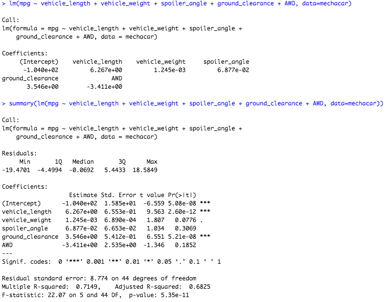
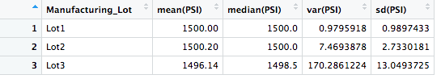
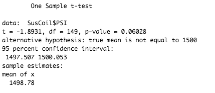
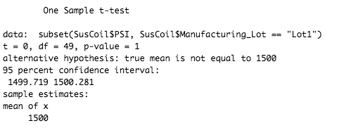
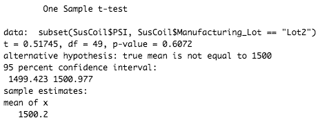
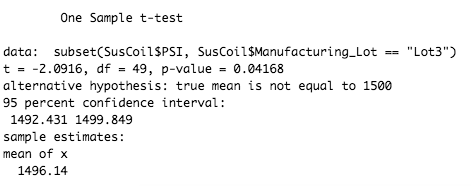

# MechaCar_Statistical_Analysis

## Linear Regression to Predict MPG

- Which variables/coefficients provided a non-random amount of variance to the mpg values in the dataset?
From the results of our linear regression model, vehicle_length and ground_clearance variables provided a non-random amount of variance to the mpg values in the dataset since their p-values are less than 0.05. 

- Is the slope of the linear model considered to be zero? Why or why not?
The slope of the linear model is not considered to be zero because there is a significant relationship between two independent variables, vehicle_length and ground_clearance, and the dependent variable, mpg. 

- Does this linear model predict mpg of MechaCar prototypes effectively? Why or why not?
The multiple r-squared is 0.7149, which is considered a strong strength of correlation, predicting the MPG of MechaCar effectively at a 71% rate.

## Summary Statistics on Suspension Coils
The design specifications for the MechaCar suspension coils dictate that the variance of the suspension coils must not exceed 100 pounds per square inch.

- Does the current manufacturing data meet this design specification for all manufacturing lots in total and each lot individually?
The total summary indicates that the current manufacturing data meets the design specification for all manufacturing lots as the variance is 76.  
On a lot basis, lot 1 and 2 meet the design requirements with a variance of 1 and 7, respectively, but lot 3 surpasses the alotted amount at 170 pounds per square inch. 

## T-Tests on Suspension Coils
I performed a t-test to determine if the PSI across all manufacturing lots is statistically different from the population mean of 1,500 pounds per square inch. I repeated this process to determine if the PSI across all individual lots are statistically different from the population mean of 1,500 pounds per square inch.

Total:

The t-test results overall shows that the p-value is greater than 0.05, meaning we fail to reject the null hypothesis for all manufacturing lots overall. 

Lot 1:

Lot 2:

Lot 3:

The p-values for the individual lots are:
Lot 1: 1
Lot 2: 0.6
Lot 3: 0.04

I am able to conclude that lot 3 is statistically different from the population mean of 1,500 lounds per square inch.

## Study Design: MechaCar vs Competition

Design: To quantify how the MechaCar performs against the competition, we are designing a statistical study using cost and safety ratings as independent variables. 

Metrics:
- Cost
- Safety Ratings

Null Hypothesis: There is no statistical difference on defined metrics between MechaCar and the competition.

Alternative Hypothesis: There is a statistical difference on defined metrics between MechaCar and the competition.

We would run t-tests on each metric for Mechacar and the competitor. If the p-value is less than 0.05, we will reject our null hypothesis.

We would need to collect data on the specified metrics for Mechacar and the competitor.
